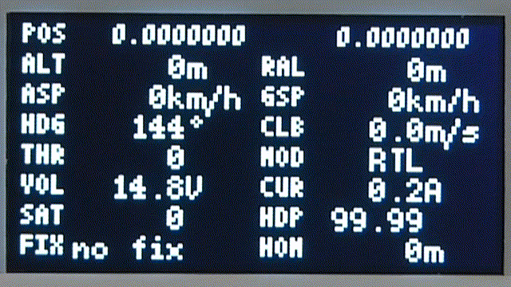

# MAVLinkView
 An Arduino sketch for showing MAVLink telemetry data
## Use case
I'm using this to show telemetry data on my [Open.HD](https://openhd.gitbook.io/open-hd/) ground station. In this case, the data is provided by a Raspberry Pi via the serial interface on the GPIO port.
## Features
* It shows telemetry data on a small display. Additional to the directly received parameters, the home distance of the vehicle is calculated and shown.
* There is a timeout monitoring of the belonging MAVLink messages, a timeout is indicated by a blinking value label.
* In case of message timeout, the last received data will be stored permanently into EEPROM - it will be shown until new data arrives, even after a power cycle. This can be very useful if you lost your vehicle.
* There is one touch sensor field provided for toggling between the default text mode and a QR mode.
* The code shown in QR mode is intented to be scanned by a smartphone for fast navigation to the last known vehicle position. Various map providers are selectable at compile time.  
  
  
## Hardware
At the moment I'm running the sketch on a [Teensy® LC](https://www.pjrc.com/store/teensylc.html), but any other 32bit Teensy® or Arduino should work as well. Please note, that the Teensy® LC is pretty much maxed out in terms of Flash Memory - if you want to add some more features it may be wise to choose a device with more than 64kB Flash.  

The display is required to have a resolution of 128 x 64 pixels, I'm using a SPI controlled OLED type from [here](https://aliexpress.com/item/33021401915.html). During my tests I found that the multiplexed control scheme of the OLED display may interfere with some smartphone cameras (rolling shutter) while trying to scan the QR code. I suppose, an E-Ink display would perform better in that area. Anyways, before choosing a display please make sure that it is supported by the [u8g2 library](https://github.com/olikraus/u8g2/)!  
  
The touch sensor can be a small piece (> 20mm x 20mm) of self-adhesive copper film or sheet metal, soldered on a short wire and connected to a touch enabled Arduino pin.
## Customization
* If you don't use a display with SSD1306 (or compatible) or if it is not controlled by hardware SPI (4 wire), the u8g2 constructor needs to be adapted accordingly.
* Check if all Arduino pin numbers match your hardware.
* Adapt the touch sensor threshold by executing the following steps:
  1. Uncomment this line of code:  
    `//#define DebugTouch`
  2. Build and watch the debug output. Note the value for `touchLevel` once the sensor is untouched and once it is touched.
  3. Subtract some safety margin from the touched value and enter it in this line of code:  
  `const int TouchOnLevel = 680;`  
  4. Add some safety margin to the untouched value and enter it in this line of code:  
  `const int TouchOffLevel = 620;`
  5. Build again and watch the debug output. The shown value for `sensorTouched` should be `0` in case the sensor is untouched and `1` if the sensor is touched.
  6. If you are happy with the result, comment the line again you uncommented in the first step.
* Optional, you could change the map provider used in QR code generation in this line of code:  
  `const MapProvider_t MapProvider = MapProviderGoogle; // select map provider`
## Build the code
Place the contents of the [Arduino](Arduino) folder into your Arduino sketch folder and install the following libraries via the Arduino Library Manager:  
- u8g2: https://github.com/olikraus/u8g2
- CRC: https://github.com/RobTillaart/CRC
## Credits
This sketch wouldn't be possible in it's current form without including code from different sources directly:
- MAVLink: https://mavlink.io
- QR Code generator library: https://github.com/nayuki/QR-Code-generator
- Haversine formula should be public domain.  